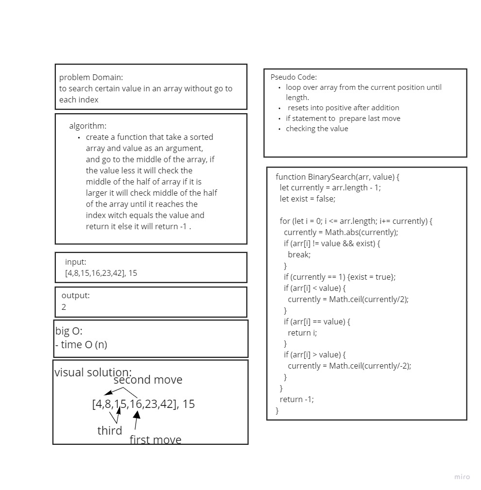

# array Binary Search
search a value inside array without go through each elementss
## Challenge
 takes in 2 parameters: a sorted array and the search key. Without utilizing any of the built-in methods available to your language, return the index of the array’s element that is equal to the search key, or -1 if the element does not exist.

## Approach & Efficiency
 Without utilizing any of the built-in methods available to js

## API
