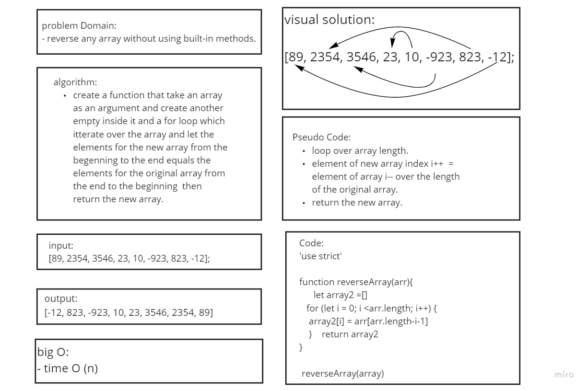

# Challenge Summary
to write a function that reverse the elements of any array

## Challenge Description
the function should takes an array as an argument. return an array with elements in reversed order.

## Approach & Efficiency
use a function to reverse the elements of the array Without utilizing any of the built-in methods available to javascript.

## Solution
