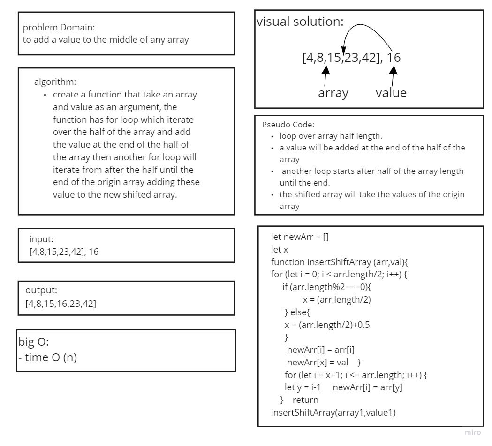

# shift an Array
to add a value to the middle of any array
## Challenge
a function which take in an array and the value to be added, return an array with the new value added at the middle index.

## Approach & Efficiency
to add the value to the middle of the array  Without utilizing any of the built-in methods available to js
## Solution
