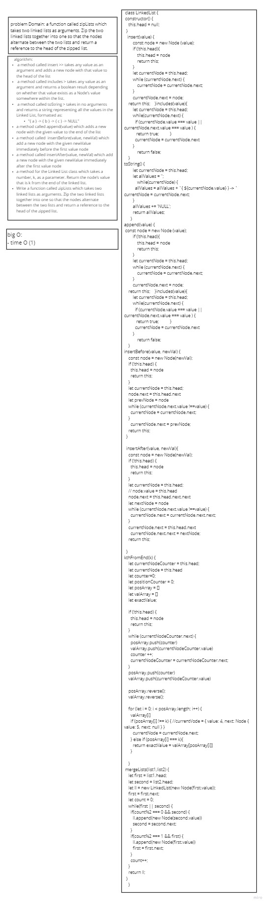

# Singly Linked List
a linked list consists of nodes where each node contains a data field and a reference(link) to the next node in the list.

## Challenge
to create linked list and insert values inside it and check them 

## Approach & Efficiency
to create linked list and insert values inside it and check them 

## API
 a method called insert >> takes any value as an argument and adds a new node with that value to the head of the list
 a method called includes > takes any value as an argument and returns a boolean result depending on whether that value exists as a Node’s value somewhere within the list.
 a method called toString > takes in no arguments and returns a string representing all the values in the Linked List, formatted as:
"{ a } -> { b } -> { c } -> NULL"

